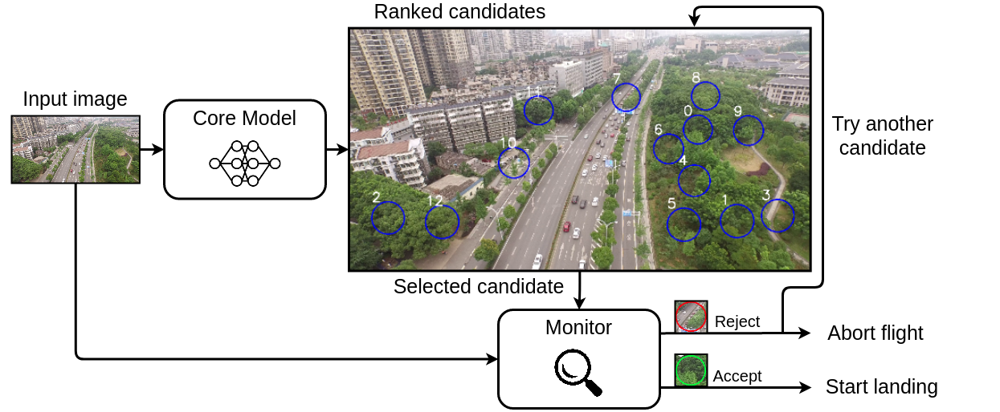

## Use Case 3 - Semantic Segmentation for UAV Emergency Landing

Use Case 3 is based on experiments from our previous ICRA 2022 paper: 
**Evaluation of Runtime Monitoring for UAV Emergency Landing**.

To reproduce the experiments from use case 3, please use the code from the following repository:
https://jorisguerin.github.io/ANITI_UavEmergencyLanding/